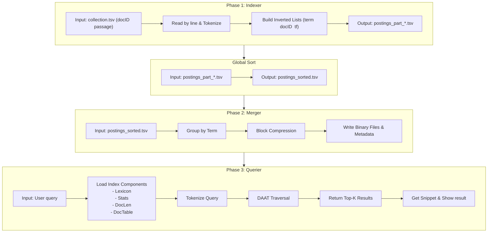

# **Search Engine Based on Compressed Inverted Index**

Suwen Wang(sw6359), Yiheng Chen(yc7766)

------

## **1. Introduction**

This project implements a **search engine** in **C++** based on a **compressed inverted index**.
It uses the **MS MARCO Passage Ranking Dataset** (8.8 million documents) as input and builds a complete end-to-end pipeline for indexing and retrieval.

The system includes three main components:

1. **Indexer** — parses and tokenizes text, then builds initial posting lists.
2. **Merger** — sorts and compresses postings.
3. **Querier** — loads the compressed index and performs **BM25-based ranking** in both **AND** and **OR** modes.

------

## **2. How to Run the Program**

### **2.1 Prerequisites**

- **C++17 compiler** (e.g., `g++`, `clang++`)
- **G++ 7.0+**
- **Dataset:** MS MARCO Passage Ranking (`collection.tsv` format). 

------

### **2.2 Building the Executables**

```
# Phase 1: indexer
g++ -std=c++17 src/indexer.cpp -o indexer.exe -I./include -O2

# Phase 2: merger
g++ -std=c++17 src/merger.cpp -o merger.exe -I./include -O2

# Phase 3: querier
g++ -std=c++17 src/querier.cpp -o querier.exe -I./include -O2

# web server
g++ -std=c++17 src/web_server.cpp -o web_server.exe -I./include -O2 -lws2_32 -lpthread
```

After compilation, the following binaries are produced:

```
indexer.exe
merger.exe
querier.exe
web_server.exe
```

------

### **2.3 Step-by-Step Execution**

#### **Step 1. Index Construction**

```
indexer.exe data/collection.tsv output 2
```

**Parameters**：

- `data/collection.tsv`：directory of input dataset
- `output`：output directory
- `2`：Max-size of each postings file (GB), (default = 2)

**Output**：

- `output/doc_table.txt`：maps internal → external doc IDs.
- `output/doc_content.bin`:  full document text (cleaned).
- `output/doc_offset.bin`:  `(offset, length)` pairs for random access.
- `output/postings_part_*.tsv`：postings files（format：term \t docID \t tf）

------

#### **Step 2. External Sorting**

Before merging, postings must be sorted by term and document ID.

```
Git Bash/Cygwin: GNU sort
LC_ALL=C sort -t $'\t' -k1,1 -k2,2n \
  -S 70% --parallel="$(nproc)" \
  --temporary-directory='output' \
  output/postings_part_*.tsv \
  -o output/postings_sorted.tsv
```

**Parameters:**

- `-t '\t'`: Split by `\t`
- `-k 1,1`: Primary key is first column: term (lexicographic order)    
- `-k 2,2n`: Secondary key is second column: docID (numeric ascending order) 

**Output**：

- `output/postings_sorted.tsv`：merged and sorted posting files（format：term \t docID \t tf）

------

#### **Step 3. Merge and Compress**

```
merger.exe output/postings_sorted.tsv index
```

**Parameters**：

- `output/postings_sorted.tsv`：sorted posting
- `index`：output directory

**Output**：

- `postings.docids.bin`: VarByte-compressed docIDs
- `postings.freqs.bin`: VarByte-compressed frequencies
- `lexicon.tsv`: metadata for each term
- `stats.txt`:  global collection statistics
- `doc_len.bin` : document lengths used for BM25 normalization.

------

#### **Step 4. Query Interface**

After the index is built, you can perform query either through a **command-line interface (CLI)** or a **web interface**.

##### **CLI**

```
querier.exe index output/doc_table.txt --mode=or --k=10
```

**Parameters**：

- `index`：directory of the compressed index
- `output/doc_table.txt`：document table
- `mode`: query mode: `or` (disjunctive) or `and` (conjunctive)
- `k`: number of top results to return (default = 10)

**Interactive examples:**

```
> machine learning
> /and deep neural network
> /or computer vision
> /quit
```

##### **Web Interface**

```
web_server.exe index output/doc_table.txt 8080
```

**Parameters**：

- `index`：directory of the compressed index
- `output/doc_table.txt`：document table
- `8080`: port number for the HTTP server

The web interface supports:

- **AND / OR modes** (`--mode=and|or`)
- **Top-K retrieval** (`--k=10`)
- **BM25 parameters** (`--k1`, `--b`)

------

## **3. Workflow**



------

## **4. Main Functions and Implementation Details**

This section details key components and data structures.

### **4.1 Phase 1: Index Builder**

#### **Responsibilities**

- Parse the dataset line by line.
- Tokenize text via `tokenize_words()`.
- Count term frequencies per document.
- Output postings in TSV format.

#### 4.1.1 Tokenize

**Function**：

- Convert all non-ASCII chars into 'Space', convert all ASCII chars into lowercase 
- Split by 'Space'
- Keep all tokens

#### 4.1.2 Construct Inverted List

**Procedure**：

1. Read TSV file by lines
2. Tokenize all the documents
3. Accumulate frequency of each word
4. When reaching the limit of the shard size, write out the current batch

**Format**：

```
term \t docID \t tf
```

------

### **4.2 Phase 2: Index Merger**

#### **Responsibility**

- Group sorted postings by term.  

- Calculate document and collection statistics, including:

  - Document Frequency (DF): number of documents containing the term.  

  - Collection Frequency (CF): total term occurrences across the corpus.  

- Compress the inverted lists

- Generate metadata 


#### 4.2.1 VarByte Encoding

**Principle:**
 Variable-byte encoding stores small integers in fewer bytes, saving space while maintaining fast decoding speed.

**Compression efficiency**

| Value Range           | Bytes Used |
| --------------------- | ---------- |
| 1–127                 | 1 byte     |
| 128–16,383            | 2 bytes    |
| 16,384–2,097,151      | 3 bytes    |
| 2,097,152–268,435,455 | 4 bytes    |

#### 4.2.2 Delta Encoding

**Principle**

Instead of storing absolute document IDs, store **differences (gaps)** between consecutive IDs, since docIDs are sorted and gaps are usually small.

```cpp
// Original docIDs: [5, 8, 15, 23, 42]
// Delta-encoded:   [5, 3, 7, 8, 19]
// VarByte-encoded: [0x05, 0x03, 0x07, 0x08, 0x13]
```

**Benefits:**

Greatly improves compressibility because small gaps → smaller VarByte values.

#### 4.2.3 Blocked Storage

The merger organizes postings into **fixed-size blocks** (default: 128 entries per block).
 Each block is compressed separately to allow partial decompression at query time.

**DocIDs block**：

```
[block_len: VarByte]
[docID_0: VarByte]
[gap_1: VarByte]  // docID_1 - docID_0
[gap_2: VarByte]  // docID_2 - docID_1
...
```

**Freqs block**：

```
[block_len: VarByte]
[tf_0: VarByte]
[tf_1: VarByte]
[tf_2: VarByte]
...
```

#### 4.2.4 Lexicon

**Format:** 

```
term	df	cf	docids_offset	freqs_offset	blocks_count
```

**Field Descriptions:**

| Field           | Meaning                                                      |
| --------------- | ------------------------------------------------------------ |
| `df`            | Document Frequency – number of documents containing this term |
| `cf`            | Collection Frequency – total number of times this term appears |
| `docids_offset` | Byte offset in `postings.docids.bin`                         |
| `freqs_offset`  | Byte offset in `postings.freqs.bin`                          |
| `blocks_count`  | Number of compressed blocks for this term                    |

**example**：

```
algorithm	15234	28765	123456	234567	120
```

This means the term *“algorithm”* appears in **15,234 documents**, with **28,765 total occurrences**, and has **120 compressed blocks** stored at the given **offset**s (**123456** in docID and **1234567** in freqs).

#### 4.2.5 Statistics File

```
# Index Statistics
doc_count	8841823
total_terms	1471950
total_postings	356257866
avgdl	57.8506
total_doc_length	511505091
```

------

### **4.3 Phase3: Querier**

#### Responsibility

- processing user queries
- scoring documents using BM25
- returning the Top-K ranked results in either AND (conjunctive) or OR (disjunctive) mode
- generate query-dependent snippet and highlight query term

#### 4.3.1 BM25

**Formula：**
$$
IDF(t) = \log\left(\frac{N - df + 0.5}{df + 0.5}\right)
$$

$$
\text{score}(d, t) = IDF(t) \cdot \frac{tf \cdot (k1 + 1)}{tf + k1 (1 - b + b \cdot \frac{|d|}{avgdl})}
$$

**Parameters**：

- `k1`：Term frequency saturation (default 0.9, range 0.8-1.2)
- `b`：Length normalization (default 0.4, range 0.3-0.7)
- `N`：Total number of documents
- `df_t`：Number of documents containing term t
- `tf`：Frequency of term in document d
- `|d|`：Length of document d
- `avgdl`：Average document length

#### 4.3.2 PostingList

```cpp
class PostingList {
public:
    bool open();
    bool next();          
    bool nextGEQ(uint32_t target);  
    uint32_t docID() const;  
    uint32_t freq() const; 
};
```

**Function Overview**

- `open()` — loads initial posting block from the compressed files.
- `next()` — sequentially iterates through posting entries inside the current block.
- `nextGEQ()` — efficiently skips ahead to the first document ID ≥ target (used in AND mode).
- `docID()` and `freq()` — provide current document information for scoring.

#### 4.3.3 Document-At-A-Time Iteration

**Top-K Maintenance:**
 A min-heap of size *K* is used to keep the highest-scoring results efficiently.
 When the heap is full and a new score exceeds the smallest in the heap, it replaces it.

**OR  mode**：

```cpp
// Pseudo code
while any list not exhausted:
  m = minimum current docID across lists
  score m by summing contributions from terms present
  update min-heap
  advance lists that contain m
```

**AND mode**：

```cpp
// Pseudo code：
while all lists not exhausted:
  m = maximum current docID across lists
  for each list L != argmax, advance L with nextGEQ(M)
  if all lists align on same docID:
     score m and update heap
  advance all lists
```


------

### 4.4 Extra: Query-Dependent Snippet

The Querier integrates a SnippetGenerator module that dynamically extracts a short, context-aware passage from each ranked document to display to the user.

**Procedure**

- Locate query terms within document text.
- Extract surrounding context (≈200 characters).
- Clean and normalize punctuation and spacing.
- Optionally highlight matched terms (ANSI color or HTML tags).

------

## **5. Performance Evaluation**

All experiments were performed on:

- **CPU:** i9-13980HX
- **RAM:** 32 GB
- **Dataset:** MS MARCO Passage Ranking

------

### **5.1 Runtime Summary**

| Phase    | Description                      | Time    |
| -------- | -------------------------------- | ------- |
| Indexing | Parsing + posting generation     | ~3 min  |
| Sorting  | External merge sort (`GNU sort`) | ~10 min |
| Merging  | Compression + metadata building  | ~3 min  |
| Querying | Average per query                | <100 ms |

------

### **5.2 Index Size**

| File                  | Purpose                | Size    |
| --------------------- | ---------------------- | ------- |
| `postings_sorted.tsv` | Merged posting files   | 5.24 GB |
| `postings.docids.bin` | Compressed docIDs      | 461 MB  |
| `postings.freqs.bin`  | Compressed frequencies | 346 MB  |
| `lexicon.tsv`         | Term metadata          | 50.6 MB |
| `doc_len.bin`         | Document lengths       | 33.7 MB |
| `doc_content.bin`     | Passage content        | 2.78 GB |
| `doc_offset.bin`      | Offset lookup table    | 101 MB  |

------

### **5.3 Memory Usage**

| Phase   | Peak Usage   | Main Components                                              |
| ------- | ------------ | ------------------------------------------------------------ |
| indexer | ~ 2-4 GB     | Inverted list hash table                                     |
| merger  | < 100 MB     | Postings list for a single term (< 10 MB) A docLengths array (~35 MB) A read buffer (8 MB) |
| querier | ~ 100-200 MB | Lexion (~50-100 MB), Statistics (< 1 MB), Doc length table (~35 MB), Query increment( < 10 MB) |

------

## **6. Conclusion**

This project successfully implements a **complete end-to-end search engine pipeline** built entirely from first principles.
 It demonstrates how the fundamental components of modern search engines — **indexing**, **compression**, **ranking**, and **retrieval** — can be designed and optimized within a compact, modular C++ framework.

------

### **6.1 Achievements**

- **Efficient Index Construction:**
   Scalable inverted index builder capable of processing multi-gigabyte text corpora such as MS MARCO.
-  **Compact Storage:**
   Blocked **VarByte + Delta encoding** achieves a **70–80% reduction** in posting size compared to raw text.
-  **Effective Ranking:**
   Implements **BM25** with tunable parameters (`k1`, `b`) for relevance scoring.
- **Flexible Query Processing:**
   Supports both **conjunctive (AND)** and **disjunctive (OR)** modes via **Document-At-A-Time (DAAT)** traversal.
-  **Interactive Retrieval:**
   Provides both a **CLI** and a **Web interface**, with snippet generation and highlighting.

------

### **6.2 Future Work**

- **Skip Lists for Fast Skipping:**
   Store block-level maximum docIDs in the lexicon to enable logarithmic-time jumps within long posting lists.
- **Query Caching Layer:**
   Cache results and partially decoded blocks for frequently accessed terms to reduce average response time.


